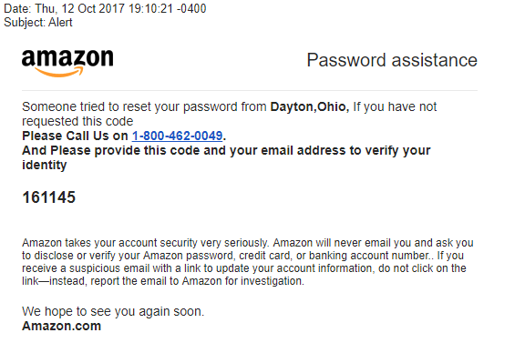

# Social Hacking
Github ([link](https://github.com/Make-School-Courses/BEW-2.3-Web-Security/blob/master/Lessons/Lesson1.md))

# How to hack a human
## Phishing

> This is a Phishing email. People get scammed by these everyday.

**Phishing** is an example of a Social Engineering attack.
It doesn't require code or even a computer.

> Lying is a lot easier than coding.

## Activity 1
> Pair up and figure out how to get an login info from your friend's roommate for Netflix.

* Ask the friend to ask his roommate
* Whenever he leaves his stuff unattended
* Install trojan
* Force his Netflix to prompt security question
* Customer Service social hacking
* Phishing email
* Get their password for something else and hope it's the same
* Blackmail

## Tailgating
> Getting access to an authorized area where you're not supposed to be

**Defense:**
* Id scans

## Quid Pro Quo
> When you trade a service (or pretend to, at least) for information

**Defense:**
* Triple Check source

## Baiting
> Is similar to Quid Pro Quo, but you are exchanging goods instead of a service, such as giving the target free video games in exchange for credentials.

**Defense:**
* Triple Check source

## Pretexting
> When you create a fabricated scenario in order to trick the victim into giving away personal information. An example would be someone calling you pretending to be the IRS and asking for your social security number over the phone.

**Defense:**
* Mitchell Check (Keep them on the line)
* Ask them to let you call them 
