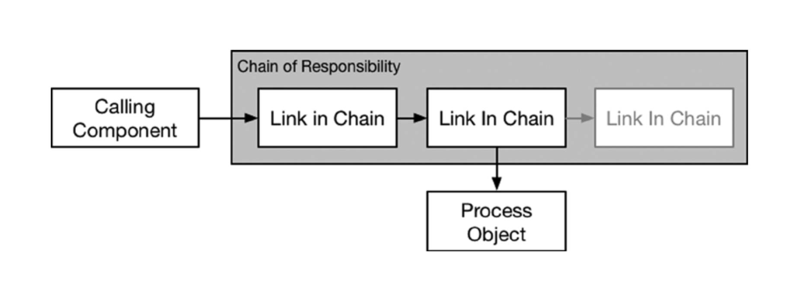
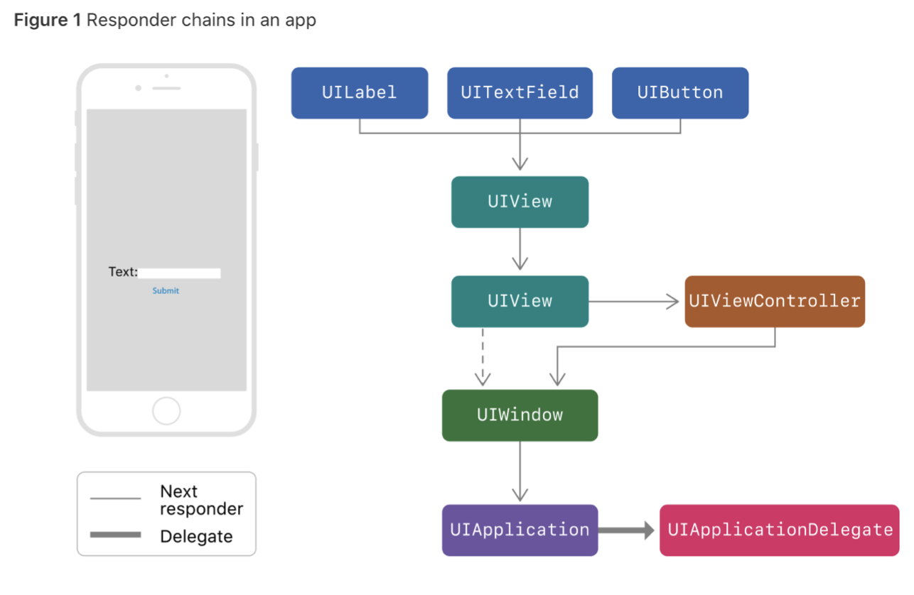

# Behavioral Patterns

Github ([link](https://make-school-courses.github.io/MOB-2.4-Advanced-Architectural-Patterns-in-iOS/Lessons//03-Behavioral-PatternsPt.1/Lesson3.md))

Slides ([link](https://docs.google.com/presentation/d/1tZXGApCRTuLN1qzL4ue5eItg5cWeuCOkSYURV_6mhvM/edit#slide=id.g55f8595b89_0_10))

Sheet w/ Ryan ([link](https://docs.google.com/document/d/1HT9vY4O426WyIUZMPyK7rCcyGp7N_l2AQ1VQLxrIoLg/edit))

We will focus on:
* Chain-of-Responsibility (CoR)
* Chain-of-Command

# Chain of Responsibility

> Pattern that allows an event to be processed by one of many handlers.
> It consists of a source of command objects and a series of processing objects.
> Each processing object contains logic that defines the types of command objects that it can handle; the rest are passed to the next processing object in the chain.

It will look for an open 'slot' able to process the object and it will keep passing it on until a processor 'gets it'

You have to code your own chain.

## When to use it?
> Use this pattern whenever you have a group of related objects that handle similar events but vary based on **event type, attributes, user choices/input, or anything else related to the event**.

## Pitfalls
> Leaking details of the object in the chain, either to one another or to the calling component.

> Delegation is an Example of CoR

# Command
> Command is a design pattern in which an object is used to encapsulate all information needed to perform an action or trigger an event at a later time. This information includes the method name, the object that owns the method and values for the method parameters

It involves three component types:
* The **invoker** stores and executes commands.
* The **command** encapsulates the action as an object.
* The **receiver** is the object acted upon by the command.

## When to use it?
> Use the Command pattern whenever you want to create actions that can be executed on receivers at a later point in time.

## Pitfalls
> It should be possible to configure an object (that invokes a request) with a request. Implementing (hard-wiring) a request directly into a class is inflexible because it couples the class to a particular request at compile-time, which makes it impossible to specify a request at run-time.

# After Class

1. Review the other Behavioral Patterns in the links below
2. Research the following concepts:
- The Composite Pattern
- `UndoManager` (in Foundation framework)
- `UIEvent` Objects
- `Touch` Objects
- All Touch Events (e.g., `touchesEnded(_:_:)`)
- the `hitTest(_:With:)` function
2. Using Apple's **Media Player** framework, implement a simple, crude (i.e., basic UI only) iPhone app that will play, pause, and restart (skip to beginning) the following sample file (or any video/audio file of your choice):

https://devimages-cdn.apple.com/samplecode/avfoundationMedia/AVFoundationQueuePlayer_HLS2/master.m3u8
